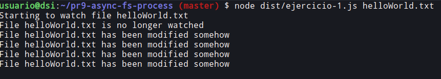

# Práctica 9: Sistema de ficheros y creación de procesos en Node.js

<p align="center">
    <a href="https://github.com/ULL-ESIT-INF-DSI-2021/ull-esit-inf-dsi-20-21-prct09-async-fs-process-alu0100785630/actions/workflows/tests.yml">
        
    </a>
    <a href='https://coveralls.io/github/ULL-ESIT-INF-DSI-2021/ull-esit-inf-dsi-20-21-prct09-async-fs-process-alu0100785630?branch=master'>
        
    </a>
</p>

## Introducción

Este es el informe de la novena práctica. He podido ampliar aún más los conocimientos acerca de las APIs de Node y distintas acciones para interactuar con el sistema de ficheros. 

## Configuración del entorno de trabajo

Como se recomienda en el guión, he intentado seguir las técinas de desarrollo que hemos aprendido hasta el momento, generar documentaicón, basar el código en pruebas, asegurarnos que el código está "cubierto", seguir principios SOLID de Programación Orientada a Objetos y un largo etc. 

Para configurar el entorno de trabjo y optimizar el tiempo  (_"not to reinvent the wheel"_ como se diría en inglés), he aprovechado el repositorio que ha facilitado el profesor Eduardo:

- [Enlace al repositorio GitHub Action para comprobar la calidad y seguridad del código fuente mediante Sonar Cloud](https://github.com/ULL-ESIT-INF-DSI-2021/github-actions-sonar-cloud)

He descargado el contenido del repositorio en mi máquina local y luego los he transferido todos los ficheros usando el comando `scp` al directorio de que he creado para la práctica en el servidor del IaaS:

```bash
usuario@dsi:~$ mkdir pr9-async-fs-process
```

```bash
alberto@xps-13:Downloads/github-actions-sonar-cloud-main $ scp -Cpr ./* dsi:/home/usuario/pr9-async-fs-process
```

Una vez hecho esto, ya tengo todo el set up con las dependencias necesarias y la estructura de ficheros. Todo lo que queda por hacer es:

```bash
npm install
```


He cambiado los ficheros `coveralls.yml`, `tests.yml`y `sonar-cloud.yml` para que escuche en la rama `master` en vez de `main`. Asimismo, he actualizado el fichero `sonar-project-properties` para que contenga la información de mi repositorio.

Una vez configurado la estructura de ficheros-directorios y las herramientas necesarias, he procedido a instalar las dependencias necesarias para la realización de la práctica:

- API síncrona de Node.JS para trabajar con ficheros:
```bash
npm install --save-dev @types/node
```
- Yargs para la utilización de argumentos:
```bash
npm install --save-dev yargs @types/yargs
```

## Ejercicios

### Ejercicio 1

Se nos pide realizar la traza de un fragmento de código mostrando los pasos y el contenido de la pila el registro de eventos de la API y la cola de manejadores de Node.js. Este es el código:

```typescript
import {access, constants, watch} from 'fs';

if (process.argv.length !== 3) {
  console.log('Please, specify a file');
} else {
  const filename = process.argv[2];

  access(filename, constants.F_OK, (err) => {
    if (err) {
      console.log(`File ${filename} does not exist`);
    } else {
      console.log(`Starting to watch file ${filename}`);

      const watcher = watch(process.argv[2]);

      watcher.on('change', () => {
        console.log(`File ${filename} has been modified somehow`);
      });

      console.log(`File ${filename} is no longer watched`);
    }
  });
}
```

A continuación, la traza de ejecución: 
1) Inicio => Pila de llamadas vacía, registro de eventos, vacío, cola de manejadores vacía.
2) main va a la pila de llamadas.
3) Comprueba si existe un fichero mediante F_OK introduciendo el método access a la pila.
4) Access no pertenece a JavaScript ni V8, por ello se pasa al registro de eventos.
5) Se introduce el handler de access en la cola de manejadores (sale del registro de eventos)
6) Ahora el handler de access es el primero en la cola, por tanto se inserta en la pila de llamadas.
7) Se inicia la ejecución del primer log en la pila de llamadas
8) Se ejecuta la acción (console.log)
9) Entra watch en la pila de llamadas
10) De nuevo, watch no pertenece a JavaScript ni V8, por ello se pasa al registro de eventos.
11) Sale watch del registro de eventos
12) Entra watcher.on en la pila de llamadas
13) Una vez más, watcher.on no pertenece a JavaScript ni V8, por ello se pasa al registro de eventos.
14) watcher.on se sigue ejecutando en el registro de eventos mientras se siguen introduciendo logs (llamadas a console.log) en la pila.
15) Se ejecuta la acción (console.log)
16) El handler de access sale de la pila y ahora la pila estará vacía.
17) Los elementos de la cola de manejadores pasan a la pila y se ejecutan (console.log)
18) Al volver a editar el fichero, se repite el proceso (no desde el principio)

---------------------------------------------------

1) 
- Pila de llamadas: --
- Registro de eventos: -- 
- Cola de manejadores: --
- Console: --

2)
- Pila de llamadas: **main**
- Registro de eventos: --
- Cola de manejadores: --
- Console: --

3)
- Pila de llamadas: **[access, main]**
- Registro de eventos: **access**
- Cola de manejadores: --
- Console: --

4)
- Pila de llamadas: **main**
- Registro de eventos: --
- Cola de manejadores: **access handler**
- Console: --

5)
- Pila de llamadas: **main**
- Registro de eventos: --
- Cola de manejadores: **access handler**
- Console: --

6)
- Pila de llamadas: **access handler**
- Registro de eventos: --
- Cola de manejadores: --
- Console: --

7)
- Pila de llamadas: **[access handler, console.log]**
- Registro de eventos: --
- Cola de manejadores: --
- Console: --

8)
- Pila de llamadas: **access handler**
- Registro de eventos: --
- Cola de manejadores: 
- Console: **Starting to watch file helloWorld.txt**

9)
- Pila de llamadas: **[watch(), access handler]**
- Registro de eventos: --
- Cola de manejadores: --
- Console: **Starting to watch file helloWorld.txt**

10)
- Pila de llamadas: **access handler**
- Registro de eventos: **watch()**
- Cola de manejadores: --
- Console: **Starting to watch file helloWorld.txt**

11)
- Pila de llamadas: **access handler**
- Registro de eventos: --
- Cola de manejadores: --
- Console: **Starting to watch file helloWorld.txt**

12)
- Pila de llamadas: **[watcher.on(), access handler]**
- Registro de eventos: --
- Cola de manejadores: --
- Console: **Starting to watch file helloWorld.txt**

13)
- Pila de llamadas: **access handler**
- Registro de eventos: **watcher.on()**
- Cola de manejadores: --
- Console: **Starting to watch file helloWorld.txt**

14)
- Pila de llamadas: **[console.log, access handler]**
- Registro de eventos: **watcher.on()**
- Cola de manejadores: --
- Console: **Starting to watch file helloWorld.txt**

15)
- Pila de llamadas: **access handler**
- Registro de eventos: **watcher.on()**
- Cola de manejadores: --
- Console: **Starting to watch file helloWorld.txt | File helloWorld.txt is no longer watched**

16)
- Pila de llamadas: --
- Registro de eventos: **watcher.on()**
- Cola de manejadores: **console.log()**
- Console: **Starting to watch file helloWorld.txt | File helloWorld.txt is no longer watched**

17)
- Pila de llamadas: **console.log()**
- Registro de eventos: **watcher.on()**
- Cola de manejadores: --
- Console: **Starting to watch file helloWorld.txt | File helloWorld.txt is no longer watched**

18)
- Pila de llamadas: --
- Registro de eventos: **watcher.on()**
- Cola de manejadores: --
- Console: **Starting to watch file helloWorld.txt | File helloWorld.txt is no longer watched | File helloworld.txt has been modified somehow**


!! Al parar la ejecución del programa salimos sacamos watcher.on del registro de eventos.

### Salida de pantalla



## Conclusión


## Bibliografía

- Recursos del aula virtual
- [TypeDoc](https://typedoc.org/)
- [Mocha](https://mochajs.org/)
- [Chai](https://www.chaijs.com/)
- [Guión de la Práctica](https://ull-esit-inf-dsi-2021.github.io/prct09-async-fs-process/)
- [Repositorio Coveralls y Sonar Cloud](https://campusingenieriaytecnologia.ull.es/mod/url/view.php?id=289851)
- [Vídeo de configuración de Sonar Cloud](https://drive.google.com/file/d/1FLPargdPBX6JaJ_85jNsRzxe34sMi-Z3/view)
- [API de Callbacks nodeJS](https://nodejs.org/dist/latest/docs/api/fs.html#fs_callback_api)
- [API asíncorna nodeJS](https://nodejs.org/dist/latest/docs/api/child_process.html#child_process_asynchronous_process_creation)